<h1 align="center">
  
</h1>

<h3 align="center">🚀 Building Production AI Systems • Applied Research • Backend Engineering</h3>

<p align="center">
  <a href="https://www.linkedin.com/in/gautham-prabhu-5b2342192/">
    
  </a>
  <a href="https://leetcode.com/gauthamprabhum/">
    
  </a>
  <a href="https://buymeacoffee.com/gauthamprabhum">
    
  </a>
</p>

<p align="center">
  
  
</p>

<div align="center">
  
  ```ascii
  ╔════════════════════════════════════════════════════════════════╗
  ║  "Building robust AI systems that work in production,          ║
  ║   not just in notebooks"                                       ║
  ╚════════════════════════════════════════════════════════════════╝
  ```
  
</div>

---

> 💛 **Supporting Independent Builders**  
> If my work helps you or inspires your projects, consider fueling the journey with coffee ☕  
> 👉 **[buymeacoffee.com/gauthamprabhum](https://buymeacoffee.com/gauthamprabhum)**

---

## 🎯 About Me

```python
class GauthamPrabhu:
    def __init__(self):
        self.role = "Software Engineer @ Cisco Systems"
        self.location = "Bengaluru, India 🇮🇳"
        self.education = {
            "degree": "B.Tech in Computer Science & Engineering",
            "institution": "Manipal Institute of Technology",
            "research_collaborations": ["IIT Kharagpur", "IISc Bangalore"],
            "publications": "ICMLDE (Q1 Journal)"
        }
        self.interests = [
            "Production AI Systems",
            "Applied Machine Learning",
            "Computer Vision",
            "Backend Engineering",
            "Research & Innovation"
        ]
        
    def current_focus(self):
        return [
            "🏗️ Building scalable AI microservices",
            "🔬 Healthcare AI & multimodal learning",
            "🛰️ Radio astronomy systems (Project Kalpana)",
            "⚡ Optimizing ML inference pipelines",
            "📊 Explainable & robust AI systems"
        ]
    
    def philosophy(self):
        return "Code that ships > Code that impresses"
```

### 💼 Professional Highlights

- **🏢 Current:** Software Engineer at **Cisco Systems**
  - Building production-grade AI services & microservices
  - FastAPI backends, agentic AI pipelines, observability at scale
  
- **🎓 Education:** B.Tech CSE from **Manipal Institute of Technology**
  - Research collaborations with **IIT Kharagpur** & **IISc Bangalore**
  - Published in **ICMLDE** (Q1 Journal)
  - Focus: Healthcare AI, small-data learning, multimodal systems

- **🎯 Core Expertise:** Where **Systems Engineering** meets **Applied AI**
  - Production ML pipelines that actually scale
  - Robustness, explainability, and real-world impact

---

## 🌟 Featured Projects & Work

<table>
<tr>
<td width="50%">

### 🏥 Healthcare AI & Multimodal Learning
- **OCT Imaging Analysis** with limited labeled data
- Robustness & interpretability in medical diagnostics
- Small-data learning techniques
- Real-world clinical deployment considerations

</td>
<td width="50%">

### ⚙️ Production AI @ Cisco
- **Microservices architecture** for AI services
- **FastAPI backends** with high availability
- **Agentic AI pipelines** for automation
- **Observability**: logging, tracing, metrics

</td>
</tr>
<tr>
<td width="50%">

### 📡 Project Kalpana
- **Co-founder** of radio astronomy initiative
- Low-cost **radio telescope systems**
- Data processing & signal analysis
- Making astronomy accessible

</td>
<td width="50%">

### 🔬 Applied ML & CV Research
- **Lane detection** for autonomous systems
- **Land-cover classification** using satellite data
- Real-time **multimodal fusion** systems
- Graph-based learning algorithms

</td>
</tr>
</table>

---

## 🛠️ Technical Arsenal

### 💻 Core Languages
<p align="left">
  
  
  
  
  
  
  
  
</p>

### 🔧 Backend & Systems
<p align="left">
  
  
  
  
  
  
  
</p>

### 🧠 AI/ML Stack
<p align="left">
  
  
  
  
  
  
  
  
  
  
  
</p>

### 🎨 Frontend Technologies
<p align="left">
  
  
  
  
  
  
  
</p>

### 🗄️ Databases & Storage
<p align="left">
  
  
  
  
  
  
  
</p>

### ☁️ DevOps & Infrastructure
<p align="left">
  
  
  
  
  
  
  
  
  
  
  
</p>

### 🧪 Data Science & Visualization
<p align="left">
  
  
  
  
  
</p>

### 🔧 Tools & IDEs
<p align="left">
  
  
  
  
  
  
  
</p>

---

## 📊 GitHub Analytics

<p align="center">
  
  
</p>

<p align="center">
  
</p>

<details>
<summary>📈 More Stats</summary>
<br>

<p align="center">
  
</p>

<p align="center">
  
  
</p>

</details>

---

## 🏆 Achievements & Contributions

<p align="center">
  
</p>

---

## 🎯 What I'm Currently Working On

```mermaid
graph LR
    A[🔬 Research] --> B[Healthcare AI]
    A --> C[Multimodal Learning]
    D[🏗️ Production] --> E[AI Microservices]
    D --> F[Observability]
    G[🛰️ Projects] --> H[Radio Astronomy]
    G --> I[Computer Vision]
    
    style A fill:#ff6b6b
    style D fill:#4ecdc4
    style G fill:#95e1d3
```



- 🔭 **Deep Diving Into:** Production ML Ops, Observability, and Model Monitoring
- 🌱 **Learning:** Advanced Kubernetes patterns, Distributed systems
- 👯 **Open to Collaborate:** AI research projects, open-source contributions
- 💬 **Ask Me About:** FastAPI, PyTorch, Computer Vision, System Design
- 📫 **Reach Me:** [LinkedIn](https://www.linkedin.com/in/gautham-prabhu-5b2342192/)

---

## 🎓 Education & Research

<table>
<tr>
<td width="50%">

### 🏛️ Education
- **B.Tech in Computer Science & Engineering**
- **Manipal Institute of Technology**
- Research collaborations with:
  - **IIT Kharagpur** - AI Research
  - **IISc Bangalore** - Computer Vision
- Focus: Healthcare AI, Small-data learning

</td>
<td width="50%">

### 📚 Publications & Research
- **ICMLDE Journal** (Q1 Publication)
- Topics: Multimodal learning, OCT imaging
- Research areas:
  - Healthcare AI systems
  - Computer vision applications
  - Small-data learning techniques
  - Explainable AI

</td>
</tr>
</table>

---

## 💡 Philosophy & Approach

<div align="center">

| 🎯 Core Beliefs | 🚀 Approach |
|:---|:---|
| **Production > Prototypes** | Build systems that scale and run 24/7 |
| **Robustness > Accuracy** | Real-world reliability matters more |
| **Explainability > Complexity** | Understand what your models are doing |
| **Ship Fast > Perfect Later** | Iterate based on real feedback |

</div>

---

## 🤝 Let's Connect!

<p align="center">
  <a href="https://www.linkedin.com/in/gautham-prabhu-5b2342192/">
    
  </a>
  <a href="https://leetcode.com/gauthamprabhum/">
    
  </a>
</p>

---

## ☕ Fuel the Journey

<p align="center">
  <a href="https://buymeacoffee.com/gauthamprabhum">
    
  </a>
</p>

<p align="center">
  <i>Every coffee fuels late-night coding sessions and new ideas! 🚀</i>
</p>

---

<div align="center">
  
  
  
  **Built with ☕, curiosity, and countless iterations**
  
</div>

<p align="center">
  
</p>
